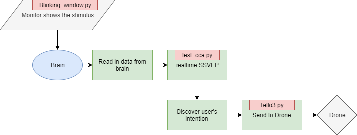

# CECNL_RealTimeBCI
### Leverage SSVEP to control drone in real time

# Procedure

# File dependency
<pre>
|-- Blinking_window.py
|-- Tello3.py
|-- test_cca.py
    |-- sample.mat [<b>input</b>]
    |-- itr.py
    |-- fbcca.py
        |-- filterbank.py
            |-- y1_from_matlab.mat [<b>test data</b>]
            |-- y2_from_matlab.mat [<b>test data</b>]
</pre>
