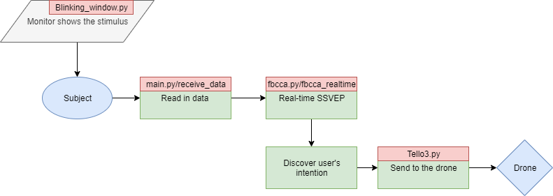

# CECNL_RealTimeBCI
### Leverage SSVEP to control drone in real time

# Procedure

# File dependency
<pre>
|-- Blinking_window.py
|-- Main.py
    |-- Tello3.py
    |-- fbcca.py
|-- test_cca.py (only for testing)
    |-- sample.mat [<b>input</b>]
    |-- itr.py
    |-- fbcca.py
        |-- filterbank.py
            |-- y1_from_matlab.mat [<b>test data</b>]
            |-- y2_from_matlab.mat [<b>test data</b>]
|-- ReceiveData.py (Under construction)
</pre>

# File description

## Blinking_window.py
- Create a window that shows the blinking indicators
- Some core parameters:
    - **frequency** : Control the frequency of the indicators
    - **POINTS** : Control the position of the indicators
    - **FrameRate** : The frame rate of your monitor (higher might be better) 

## fbcca.py
- Conduct Filter Bank CCA
- Main function : **fbcca_realtime**, slightly different version since we don't conduct the fbcca in real-time. 
- Core parameters: 
    - **THRESHOLD** : Define different threshold of different subjects, since different people might have a different response to the stimulus 
- Reference Github: https://github.com/mnakanishi/TRCA-SSVEP

## Tello3.py
- interface to the Drone 
- just use it!
- API Reference : *Reference/Tello SDK Documentation.pdf*

## Main.py
- Main function of the application
- Core parameters: 
    - Threshold : The threshold that controls how many time a certain command should accumulate before send out to the drone
    - BUFFER_SIZE : Size of the buffers
    - Filter : You can design your own filters
        - power_line_frequency : target of the notch filter

## ReceiveData.py
- Now we receive the data from LSL protocol. But we might get it directly from the USB port through Cygnus_Kernel they build. However, the function is still under construction.
- Kernel Reference: *Reference/API_V0.10.8.pdf*

# Instruction for running the system

1. Install
<pre>pip install -r requirement.txt</pre>
2. Connect to the TELLO Wifi
    1. Boot the drone
    2. Find the wifi (as shown below), and connect to that one to order the drone 
    
3. Open LSL data stream
    1. Open Cygnus
    2. Connect the device then data stream will be available
    
4. Open Blinking Window in one command window
<pre>python Blinking_window.py</pre>
5. Open another CMD window and start main program
    1. <pre>python main.py</pre>
    2. The snapshot of the execution of the program
    
6. CHECK!!!
    - The Wifi of the TELLO will close once there's no any command in around 15 seconds, so check which wifi currently connected
    - Make sure you receive **ok** as a response from the drone to ensure the drone is connected.
    - Ctrl+C to end the program and the drone will land 
    - Ignore the error(200)
    - All shown as below:
    

# Reference
- *Chen, Xiaogang, et al. "A high-itr ssvep-based bci speller." Brain-Computer Interfaces 1.3-4 (2014): 181-191.*
- *Chen, Xiaogang, et al. "High-speed spelling with a noninvasive brain–computer interface." Proceedings of the national academy of sciences 112.44 (2015): E6058-E6067.*
- *Nakanishi, Masaki, et al. "An approximation approach for rendering visual flickers in SSVEP-based BCI using monitor refresh rate." 2013 35th Annual International Conference of the IEEE Engineering in Medicine and Biology Society (EMBC). IEEE, 2013.* 